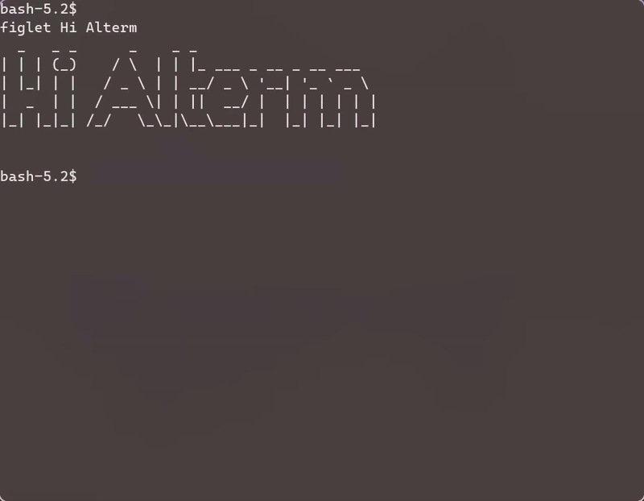

<!-- Improved compatibility of back to top link: See: https://github.com/othneildrew/Best-README-Template/pull/73 -->

<a  id="readme-top"></a>

<!--

*** Thanks for checking out the Best-README-Template. If you have a suggestion

*** that would make this better, please fork the repo and create a pull request

*** or simply open an issue with the tag "enhancement".

*** Don't forget to give the project a star!

*** Thanks again! Now go create something AMAZING! :D

-->

  
  
  

<!-- PROJECT SHIELDS -->

<!--

*** I'm using markdown "reference style" links for readability.

*** Reference links are enclosed in brackets [ ] instead of parentheses ( ).

*** See the bottom of this document for the declaration of the reference variables

*** for contributors-url, forks-url, etc. This is an optional, concise syntax you may use.

*** https://www.markdownguide.org/basic-syntax/#reference-style-links

-->

  
  
  
  
  
  

<!-- TABLE OF CONTENTS -->

<details>

<summary>Table of Contents</summary>

<ol>

<li>

<a  href="#alterm---simple-sdl2-terminal-emulator">Alterm - Simple SDL2 Terminal Emulator</a>

<ul>

<li><a  href="#Features">Features</a></li>

</ul>

</li>

<li>

<a  href="#getting-started">Getting Started</a>

<ul>

<li><a  href="#prerequisites">Prerequisites</a></li>

<li><a  href="#bulding-alterm">Bulding Alterm</a></li>

</ul>

</li>

<li><a  href="#project-structure">Project Structure</a></li>

<li><a  href="#usage">Usage</a></li>

<li><a  href="#settings-keys">Settings Keys</a></li>

<li><a  href="#license">License</a></li>

<li><a  href="#future-work">Future Work</a></li>

<li><a  href="#what-i-learned">What I Learned</a></li>

</ol>

</details>

  
  
  

<!-- ABOUT THE PROJECT -->

# Alterm - Simple SDL2 Terminal Emulator

  

Alterm is a lightweight, minimal terminal emulator built using **C++** and **SDL2**. It provides a simple and minimalistic interface for terminal operations, allowing users to execute basic shell commands, navigate directories, and utilize tab-based auto-completion for command and file names. The terminal emulator is designed to be lightweight and easy to use, making it suitable for various applications and environments.

  
  
  
  

<p  align="right">(<a  href="#readme-top">back to top</a>)</p>

  
  
  

## Features

  

- [x] **PTY Shell Integration**: Alterm leverages the POSIX PTY (Pseudo-Terminal) interface to create a virtual terminal, enabling seamless integration with the underlying operating system's shell. This allows Alterm to execute shell commands and interact with the terminal environment as if it were a regular terminal emulator.

- [x] **Command History**: Alterm maintains a command history, enabling users to easily navigate through previously executed commands using the up and down arrow keys. This feature provides a convenient way to access and reuse previous commands, enhancing productivity.

- [x] **SDL2-based UI**: Alterm utilizes the SDL2 library to create a graphical user interface (GUI) for the terminal emulator. This GUI provides a visually appealing and interactive experience, allowing users to interact with the terminal in a more intuitive manner.

- [x] **Built-in Settings Mode** (`settings`, `set`, `save`,`exit`): Alterm allows users to access and modify its settings using the `settings` command. This feature provides a convenient way to customize various aspects of the terminal emulator, such as colors, fonts, and other visual elements.

- [x] **Custom Font Rendering** using `SDL_ttf**`: Alterm supports custom font rendering using the SDL_ttf library. Users can specify a custom font file and apply it to the terminal emulator's UI, resulting in a visually appealing and tailored appearance.

- [x] **Auto-scroll & Scrollback**

- [x] **Live Cursor With Blinking Effect**

  
  

## ScreenShots

  



  
  
  
  

<p  align="right">(<a  href="#readme-top">back to top</a>)</p>

  
  
  
  

<!-- GETTING STARTED -->

## Getting Started

  

These instructions will help you build and run alterm.

  

### Prerequisites

  

Make sure you have the following installed on you system:

- [g++](https://gcc.gnu.org/) version 11 or higher

- [cmake](https://cmake.org/) version 3.21 or higher

- [SDL2](https://www.libsdl.org/) version 2.0 or higher

- [SDL2_ttf](https://www.libsdl.org/projects/SDL_ttf/)

- Unix-like environment (Linux, [WSL](https://learn.microsoft.com/en-us/windows/wsl/install), or macOS)

  
  

## Building Alterm

  

Clone the repository and build the project using the provided Makefile.

```bash

$  git  clone  https://github.com/zoldyck13/alterm.git

$  cd  alterm

```

  

#### Project Structure

```

├── alterm/
│ ├── include/
│ │ ├── Alterm.hpp
│ │ ├── AnsFilter.hpp
│ │ ├── FontManagar.hpp
│ │ ├── forkpty.hpp
│ │ ├── HistoryManager.hpp
│ │ ├──SettingsManager.hpp
│ │
│ ├── src/
│ │ ├── Alterm.cpp
│ │ ├── AnsFilter.cpp
│ │ ├── FontManager.cpp
│ │ ├── forkpty.cpp
│ │ ├── HistoryManager.cpp
│ │ ├── main.cpp
│ │ ├── SettingsManager.cpp
│ │
│ │
│ │
│ ├── Makefile
│ ├── README.md
├ ├── LICENSE
├ ├──.alterm_history
├ ├── .alterm_settings
│ ├── assets/
│ │ ├── Fonts/
│ │ ├── Alterm.gif
│ │
│ │

  

```

```bash

$  make

```

This will build the source code and generate the executable `./alterm`.

  
  

### Running Alterm

  

After building the project, run the terminal with:

```bash

$  ./alterm

```

  
  

### Usage

  

You can enter:

- ** Shell commands** like ls, cd, top, etc.

- Type `settings` to enter Settings Mode:

- set <key>  <value> - change settings

- save - write settings to .alterm_settings

- exit - exit settings mode

  
  

### Example

```bash

settings

set  font_size  16

save

exit

```

  
  

### Settings Keys

### Settings Keys

| Key             | Description                      |
|------------------|----------------------------------|
| font_size       | Font size (int)                  |
| font_family     | Path to TTF font                 |
| font_color_r/g/b| Font color (R, G, B)             |
| bg_color_r/g/b  | Background color (R, G, B)       |
| bg_opacity      | Background transparency (0–255)  |
| auto_scroll     | Enable/disable auto scroll       |

  
  
  

## Future Work

  

- [ ] Cursor navigation (<- / ->)

- [ ] In-line text editing

- [ ] Text selection and clipboard support

- [ ] Command auto-completion and Tab completion

- [ ] Mouse-based interaction

- [ ] Syntax highlighting

- [ ] ANSI escape sequences support

  
  

---

## What I Learned

- Deepen understanding of pseudo-terminal communication

- Learn real-time rendering with SDL2

- Create a customizable terminal-like interface from scratch

  
  
  
  

## Licnese

  

This project is licensed under the MIT License - see the [LICENSE](LICENSE) file for details.
